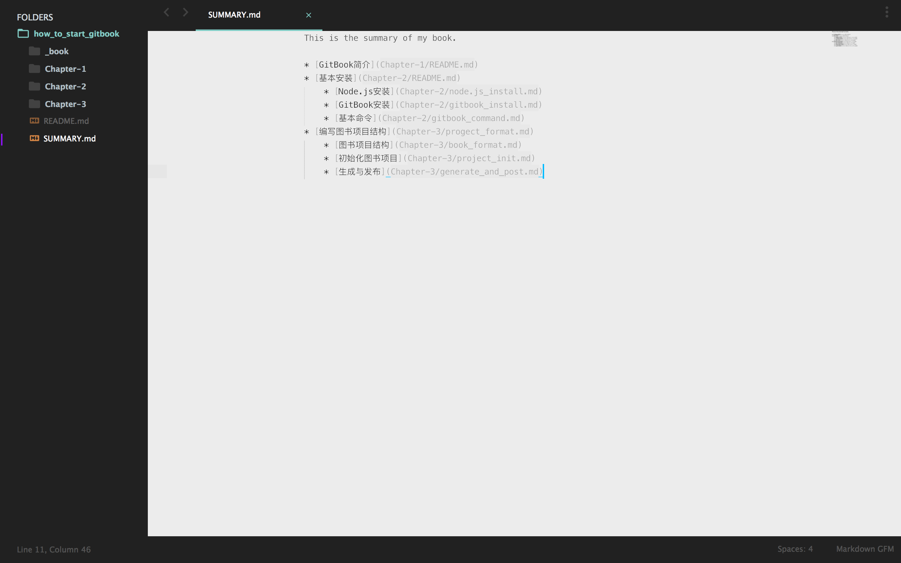

# GitBook安装

GitBook的安装方式有多种，你既可以选择使用npm方式安装，仅仅安装gitbook的相关功能：

```
npm install gitbook-cli -g
```

再配上一个自己喜欢的Markdown编辑器(这里我使用的是Sublime Text):



也可以选择去 [官网](https://www.gitbook.com) 下载对应平台的编辑器（包含GitBook和Markdown编辑器）：


官网下载的编辑器带有类似于Macdown一样的实时预览功能。
